# Lab 1: Hands-on Cloud Security with FortiCNAPP

## Objectives

- Understand FortiCNAPP capabilities
- Navigate the FortiCNAPP console
- Review key security features and dashboards

## Prerequisites

- Email address for sign-in
- Web browser
- Access to email inbox for sign-in link

## Lab Steps

### Step 1: Access FortiCNAPP Console

*How do we access the FortiCNAPP demo environment and select the appropriate tenant?*

1. Navigate to <a href="https://partner-demo.lacework.net/" target="_blank">https://partner-demo.lacework.net/</a>
2. Enter your email address
3. Click **Get sign in link**

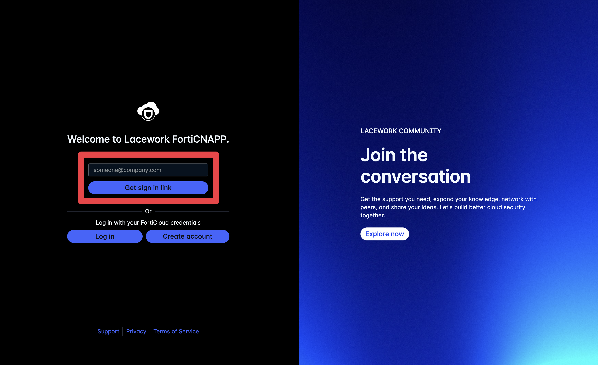

4. Check your email and click the sign-in link
5. If you see an onboarding wizard, skip it and select **Go to platform**
6. Select the **FORTIDEMO** tenant from the bottom of the navigation drawer

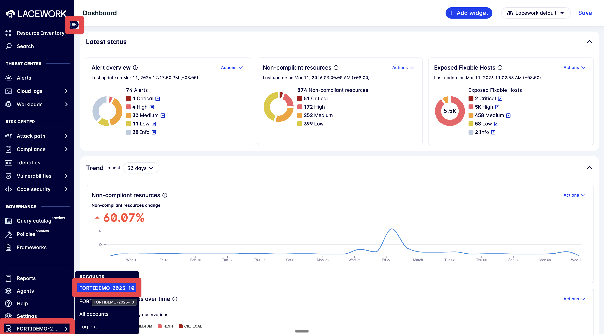

7. Review the main dashboard

### Step 2: Explore Discovery Features

*"What exists in my cloud environment, and what should I worry about first?"*

FortiCNAPP's Discovery features provide visibility into cloud resources, their relationships, and their risk context.

#### Resource Inventory

*"I don't know what cloud resources I have, or which ones are riskiest."*

Resource Inventory shows all cloud resources across accounts with vulnerability counts, misconfigurations, and risk context to prioritize remediation.

1. Navigate to **Discovery** > **Resource Inventory** in the left navigation panel
2. Filter by **Resource Type = ec2:instance** using the filter dropdown
3. Sort the table by **Vulnerabilities** (click the Vulnerabilities column header or use the "Sort: Vulnerabilities" option)
4. Review the table to identify which EC2 instances have the highest number of vulnerabilities

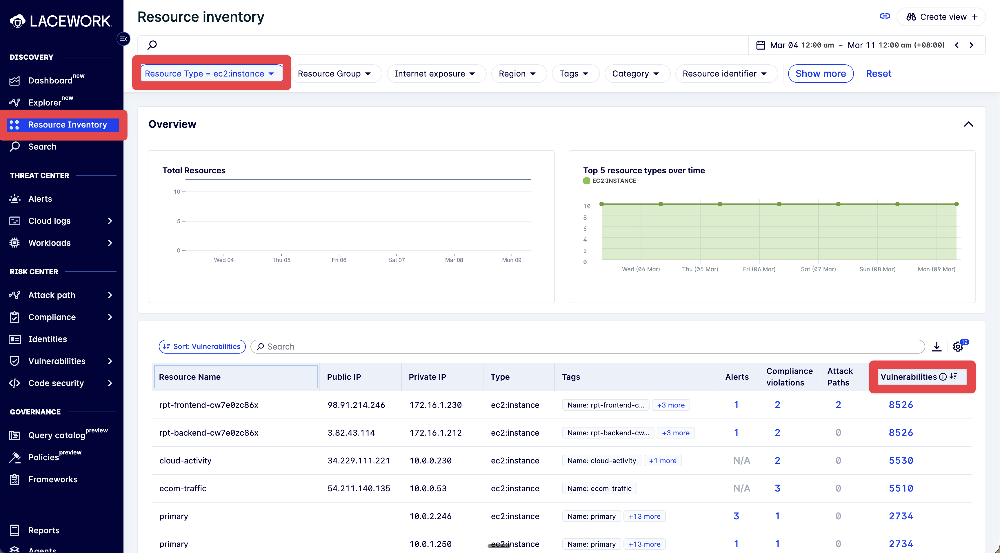

#### Explorer

*"How do my cloud resources relate to each other, and where are the toxic combinations?"*

Explorer lets you build custom queries and visualize relationships between resources, identities, and attack paths.

1. Navigate to **Discovery** > **Explorer** in the left navigation panel
2. Click **Build your own query**
3. In the query builder, ensure **SHOW** is set to **Hosts**
4. Click **+ Add clause**
5. Add a **WHERE** clause: **Internet Exposed** = **true**
6. Click **Search** to execute the query

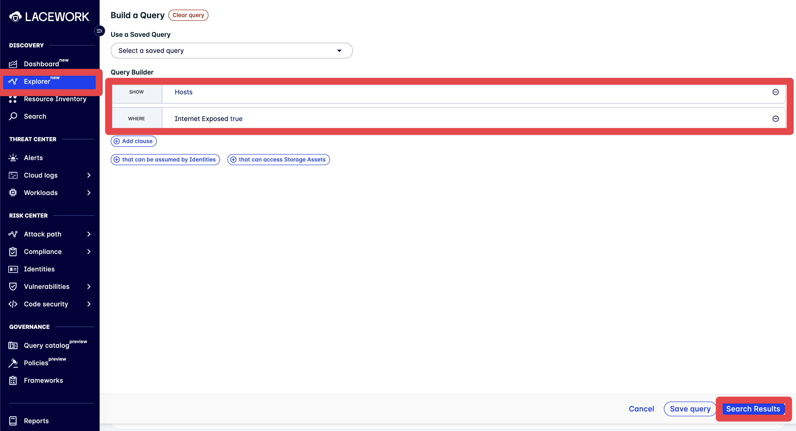

7. Review the results to see hosts that are part of attack paths
8. For one or more hosts in the results, click **Graph** to visualize relationships
9. Explore the graph view to understand how these hosts connect to other resources, identities, and potential attack vectors

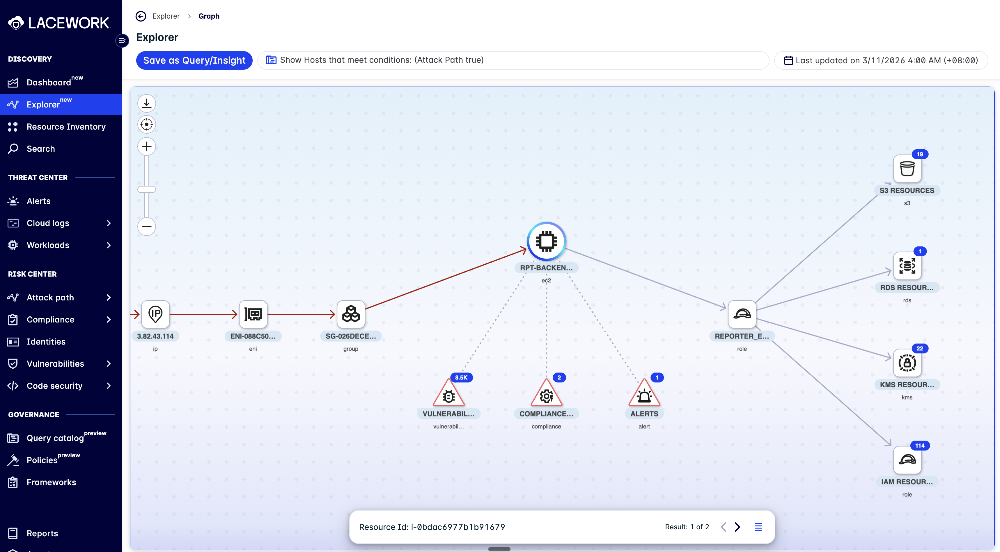

10. For a host in the results, review its details. How many vulnerabilities are actually active?

#### Search

*"I want to quickly look up a specific asset and understand what it's doing."*

Search provides instant lookup of any known asset, showing its connections, processes, and resource consumption.

*Customers frequently ask about the FortiCNAPP agent (datacollector): What does it talk to? How much CPU does it use? What is the memory usage trend? FortiCNAPP provides visibility into these metrics for any application, not just the agent itself.*

1. Click the **Search** icon in the left navigation panel
2. Search for **datacollector** (this is the FortiCNAPP agent application)

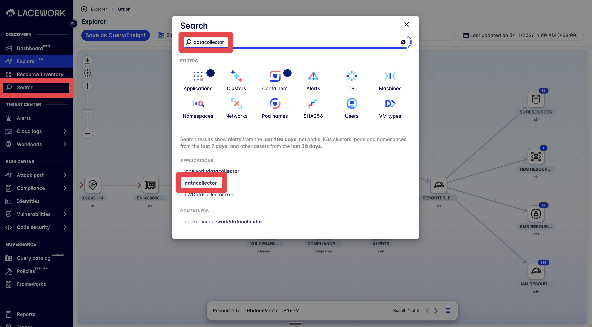

3. In the search results, click on **datacollector**
4. Review the application details to investigate what datacollector is doing in the cloud environment:
   - What network connections is it making?
   - What processes is it running?
   - How is it consuming resources?
5. Answer the following questions:
   - What is the datacollector memory usage trend?
   - What is the CPU usage percentage?

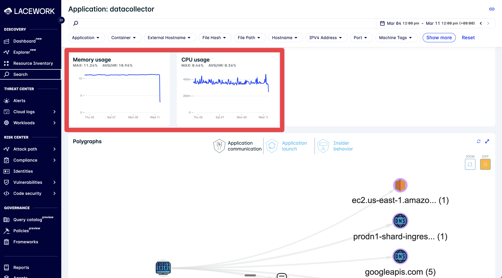

### Step 3: Explore Threat Center Features

*"Something happened in my environment — how do I investigate and respond?"*

Threat Center surfaces security incidents with timelines, severity, and behavioral analysis.

#### Alerts

*"How do I know when something suspicious happens, and what do I do about it?"*

Alerts notify you of security incidents with severity, timeline of events, and AI-assisted triage to guide response.

1. Navigate to **Threat Center** > **Alerts** in the left navigation panel
2. Filter by **past 6 months** using the date range selector
3. Filter for **Composite** alerts using the alert category filter

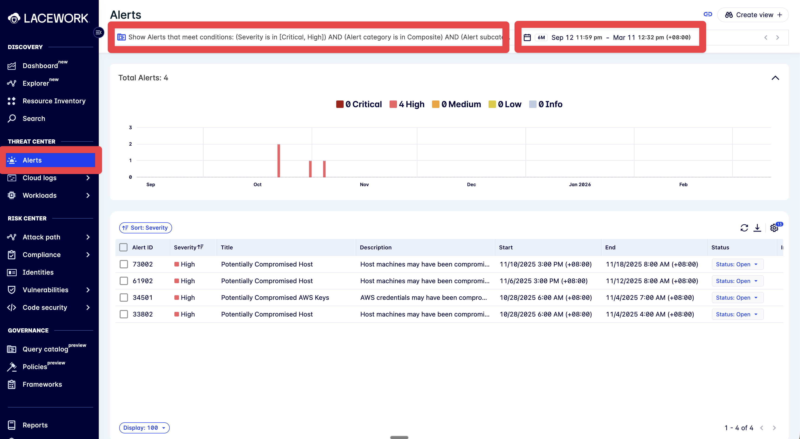

4. Open the **Potentially Compromised AWS Keys** alert
5. Click on the **Observations** tab to see the timeline of events
6. Review the observations table to understand the sequence of activities and how an attacker might have progressed through our environment

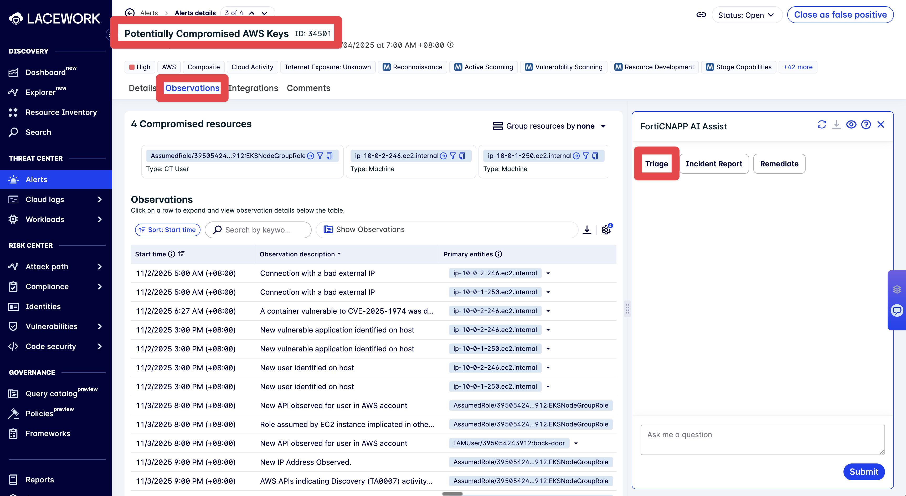

7. In **AI Assist**, click **Triage** to understand the alert

#### Workloads - Hosts

*"What's running on my hosts and what does normal look like?"*

The Hosts dashboard builds an hourly baseline of process and network activity, making it easy to spot anomalies.

1. Navigate to **Threat Center** > **Workloads** > **Hosts** in the left navigation panel
2. Scroll down to view the polygraph visualization
3. Review the polygraph, which is an hourly map of process and network activity in the cloud environment
4. Click on the timeline at the bottom to explore different periods in time
5. Scroll down to understand what is running in the environment

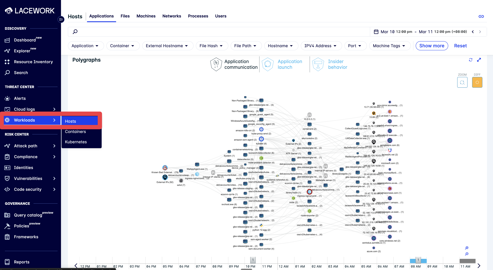

#### Workloads - Kubernetes

*"What's happening inside my Kubernetes clusters?"*

The Kubernetes dashboard shows pod, container, and network activity across namespaces and clusters.

1. Navigate to **Threat Center** > **Workloads** > **Kubernetes** in the left navigation panel
2. Click on the **Pod Network** tab to see process activity within the Kubernetes cluster

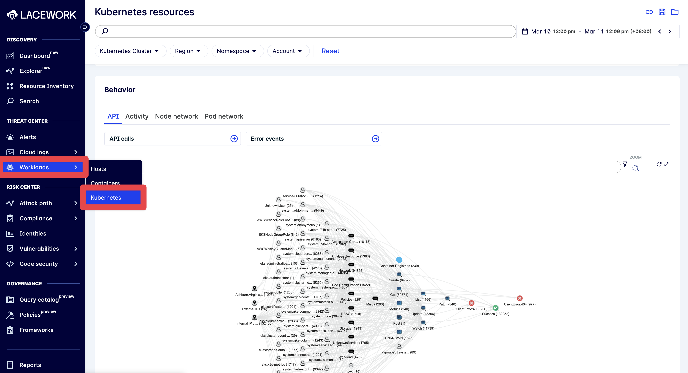

### Step 4: Explore Risk Center Features

*"Where are the biggest risks in my environment, and what should I fix first?"*

Risk Center analyzes attack paths, compliance, identities, vulnerabilities, and code security.

#### Attack Path

*"How could an attacker move through my environment?"*

Attack path analysis correlates vulnerabilities, network exposure, secrets, and IAM permissions to show exploitable paths to critical assets.

1. Navigate to **Risk Center** > **Attack Path** > **Top Work Items** in the left navigation panel

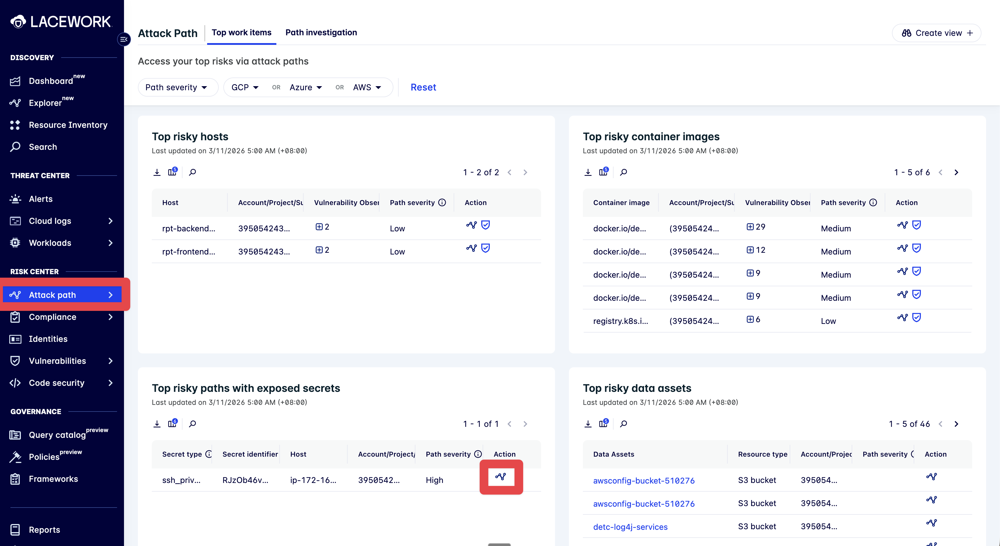

2. In the **Top risky paths with exposed secrets** section, select an entry from the table
3. Click **View Attack Path** in the **Action** column

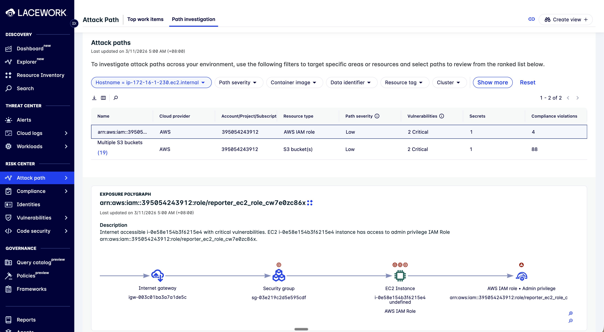

4. Investigate the attack path and answer the following questions:
   - What secret is exposed on the EC2 instance?
   - What compliance violations are present?
5. Review the security group configuration:
   - Scroll down to the security group to view details
   - Navigate to the **Configuration** tab
   - Review the **Inbound Rules** section
   - What inbound rules have open ports?
6. Review the exposed identity:
   - Scroll down to the identity section in the attack path
   - What does the exposed identity have access to do?

#### Compliance

*"Are we meeting security frameworks like CIS, PCI DSS, and HIPAA?"*

Cloud compliance provides daily assessments against industry benchmarks, showing compliant and non-compliant resources.

1. Navigate to **Risk Center** > **Compliance** > **Cloud** in the left navigation panel

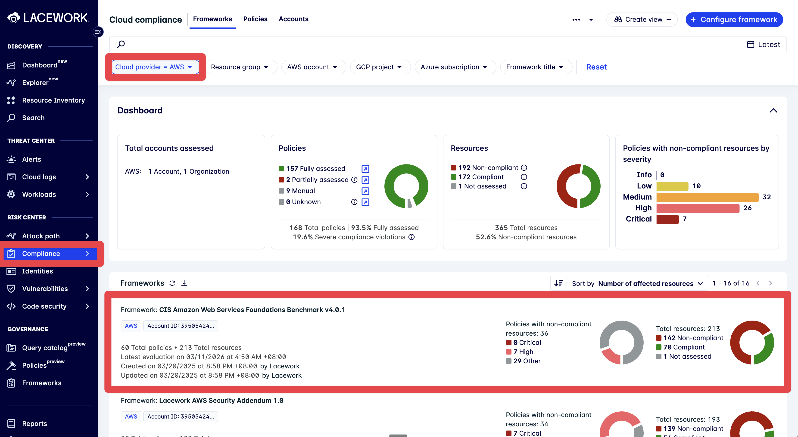

2. Click on **CIS Amazon Web Services Foundations Benchmark v4.0.1** framework
3. Click the filter icon under **By section**
4. Filter by **non-compliant resources**

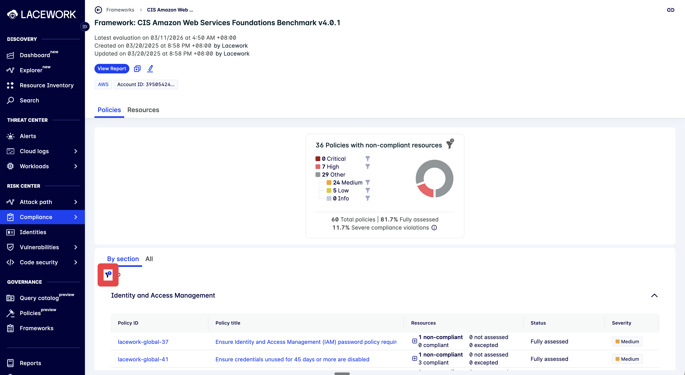

5. Click into the policy **Ensure that S3 is configured with 'Block Public Access' enabled**
6. Review the policy details. How many S3 buckets are non-compliant?
7. Click **View context** to understand the policy context

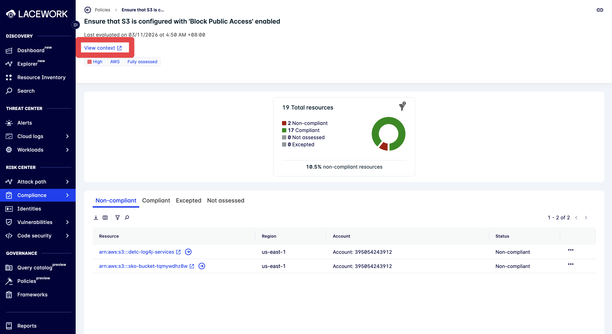

#### Identities

*"Which identities have excessive permissions?"*

Identities compares granted vs. used entitlements to help enforce least privilege across cloud users, roles, and groups.

1. Navigate to **Risk Center** > **Identities** in the left navigation panel
2. Select the **Top identity risks** tab
3. Choose an identity from the list
4. Click **Investigate** to view identity details
5. Review the **Granted vs. used entitlements** chart. How many granted vs used entitlements are shown?

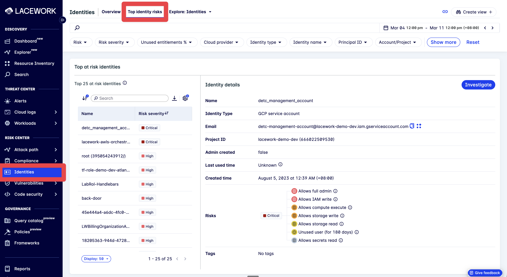

#### Vulnerabilities

*"I have thousands of vulnerabilities — which ones actually matter?"*

Vulnerabilities shows findings across hosts and containers, with active package detection to prioritize what's actually running.

1. Navigate to **Risk Center** > **Vulnerabilities** > **Vulnerabilities[New]** in the left navigation panel
2. Click **Explore: Hosts**
3. Review the list. How many hosts are vulnerable?

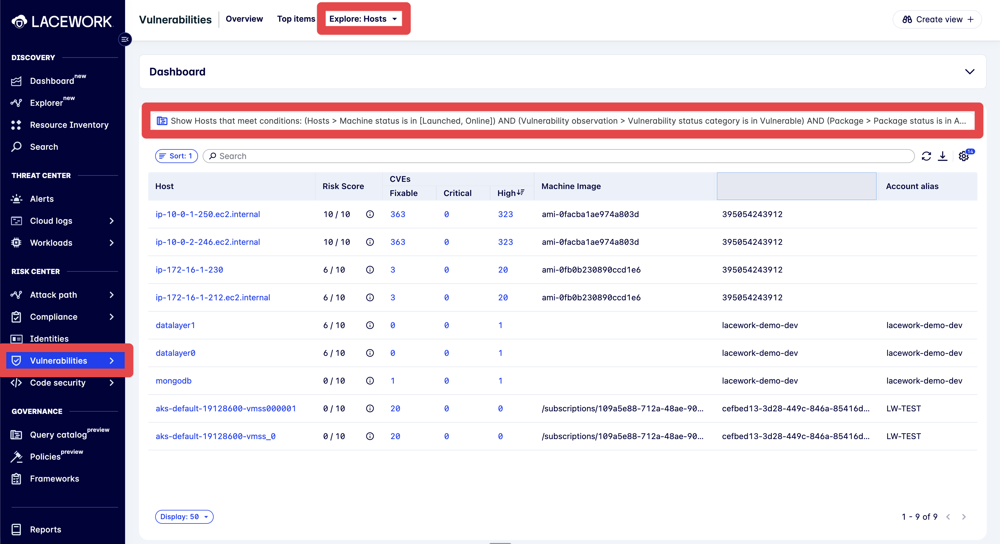

4. Click **Filter**
5. Add a clause: **Package** > **Package status** = **Active**
6. Scroll to the bottom and click **Search**
7. Review the list again. How many hosts are vulnerable with active packages?

#### Code Security

*"Are there misconfigurations or secrets in our code before we deploy?"*

Code Security scans Infrastructure as Code and application source for misconfigurations, vulnerabilities, and hard-coded secrets.

1. Navigate to **Risk Center** > **Code Security** > **Infrastructure (IaC)** in the left navigation panel
2. Choose a repository from the list
3. Review the latest assessment

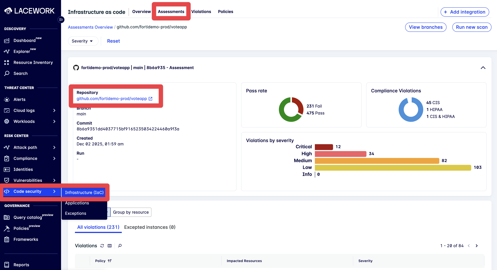

4. Navigate to **Risk Center** > **Code Security** > **Applications** in the left navigation panel
5. Select the **Vulnerabilities: Hard-coded secrets** tab

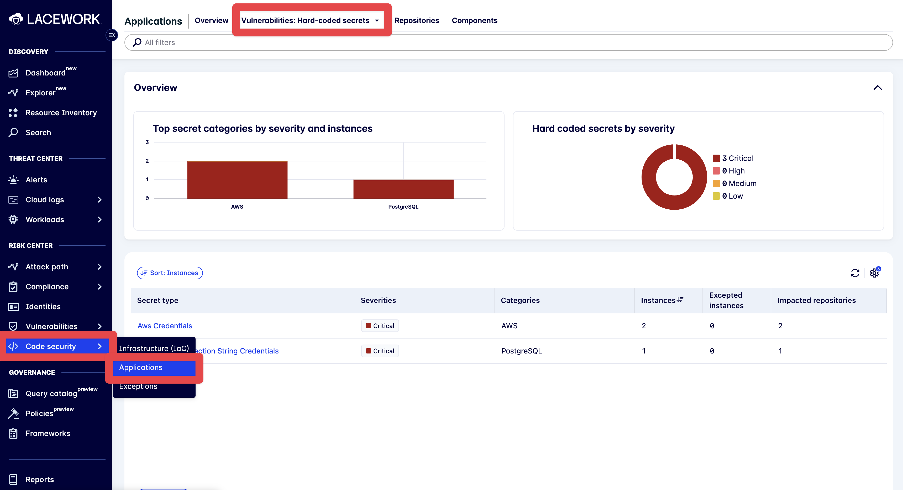

6. Click on **Aws Credentials**
7. Find the code where the access key has been published

### Step 5: Explore Governance Features

*"What rules govern what FortiCNAPP detects?"*

Governance manages the built-in and custom policies that drive risk detection and threat alerts.

#### Policies

*"How do I control what gets flagged?"*

Policies define the rules FortiCNAPP uses to detect risks and threats, and can be customized or extended with custom policies.

1. Navigate to **Governance** > **Policies** in the left navigation panel

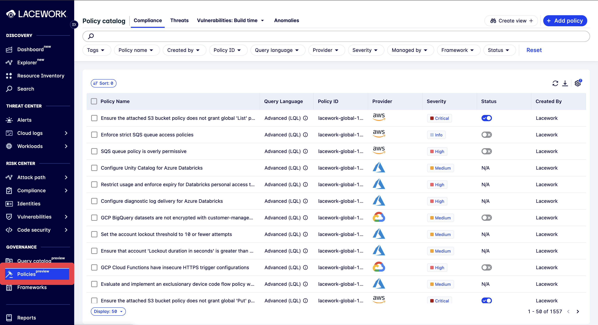

2. Review policies in the **Compliance** tab
3. Review policies in the **Threats** tab
4. Review policies in the **Vulnerabilities: Build time** tab (Build and Runtime)
5. Review policies in the **Anomalies** tab

### Step 6: Configure Settings

*How can we configure user settings?*

#### Change Tenant

1. Select the **FORTINETAPACDEMO** tenant from the bottom of the navigation drawer

#### My Settings

1. Select **Settings** > **My profile** in the Settings navigation panel
2. Disable the default email notification

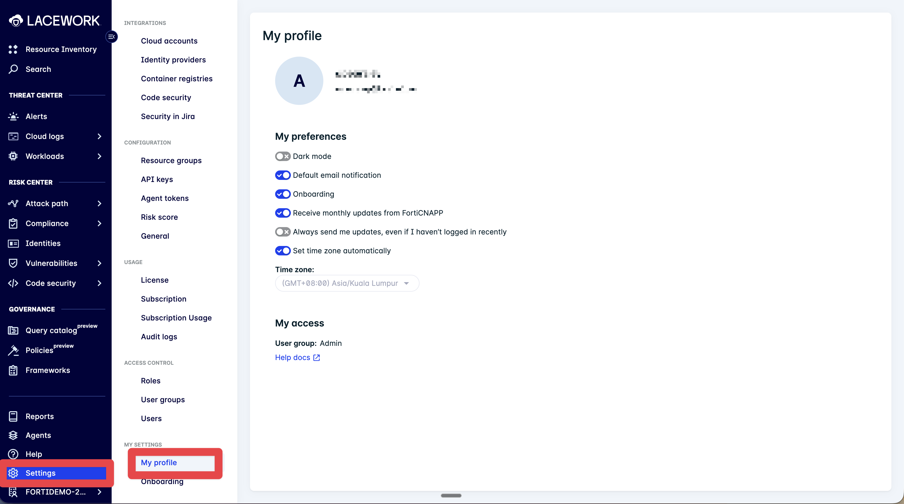

