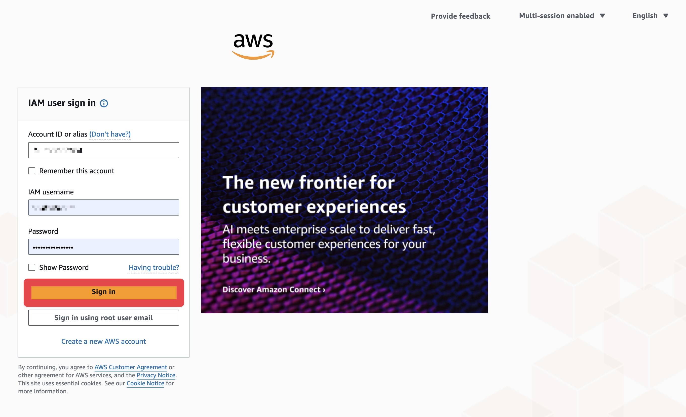
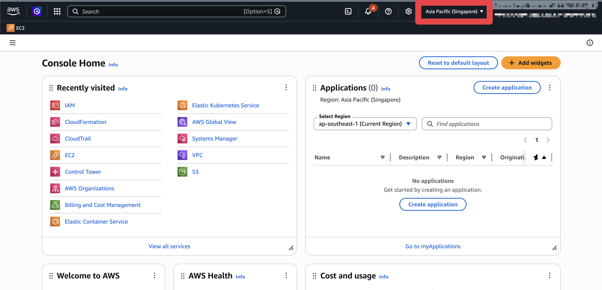
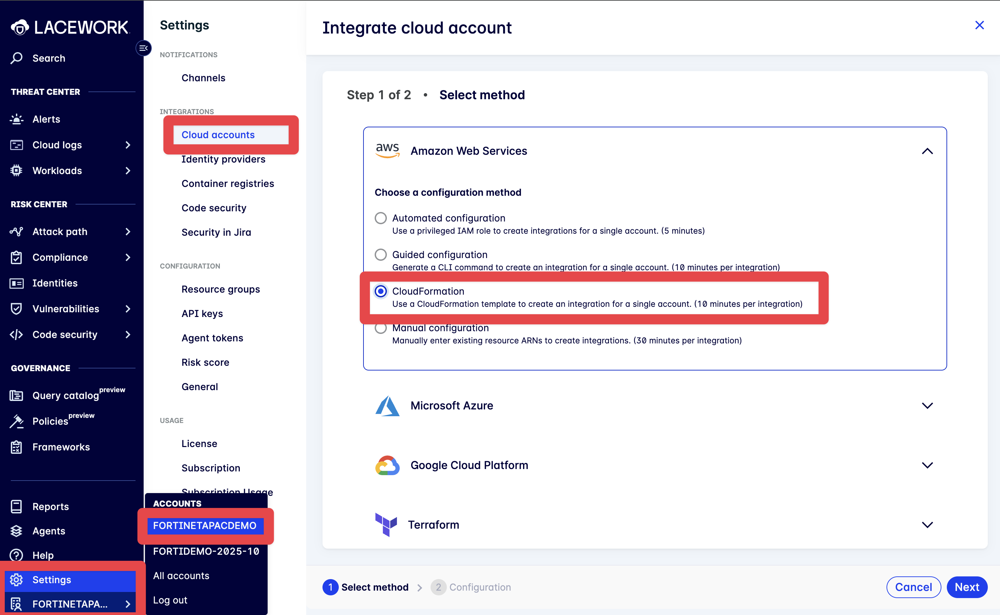
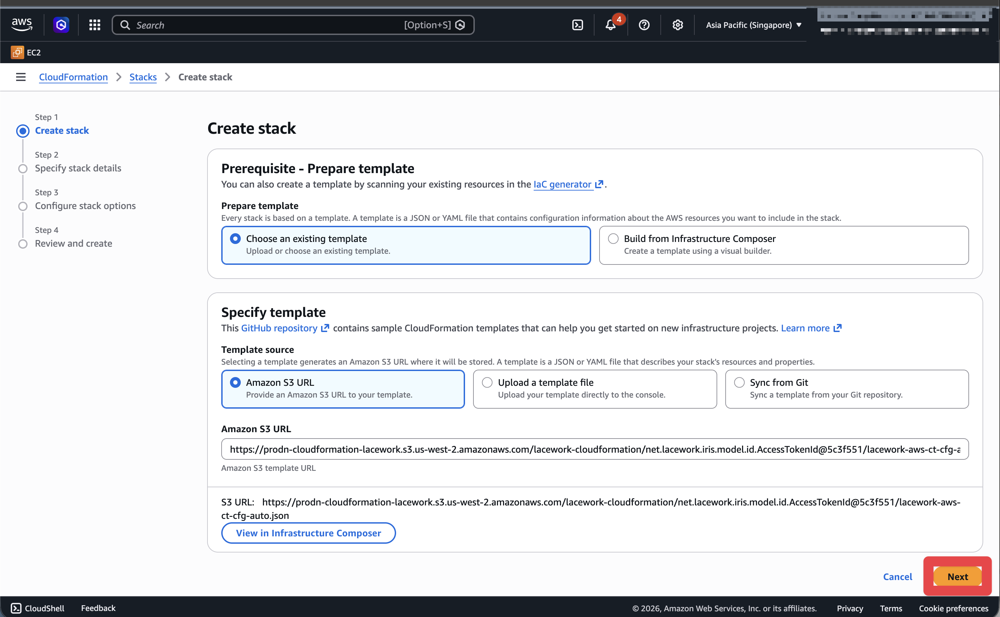
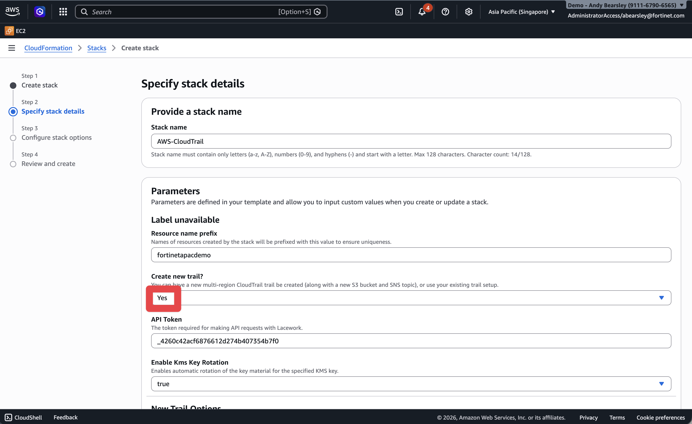
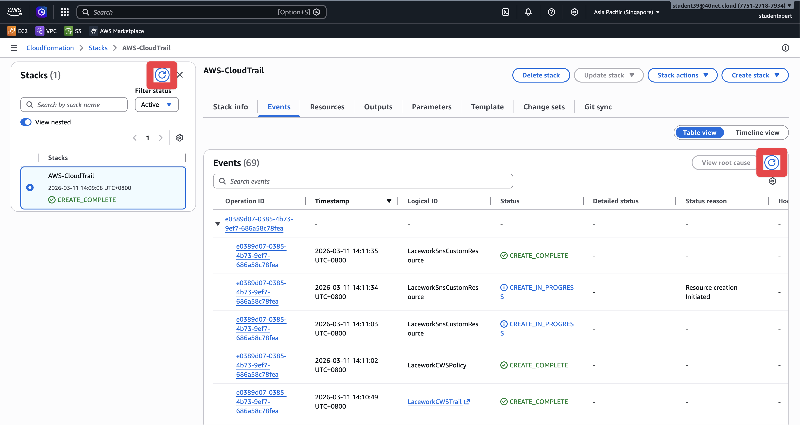
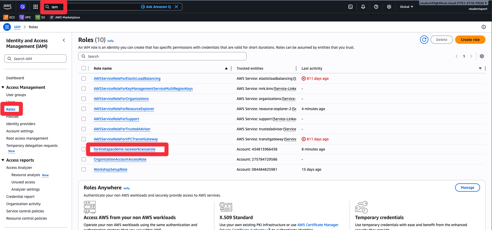
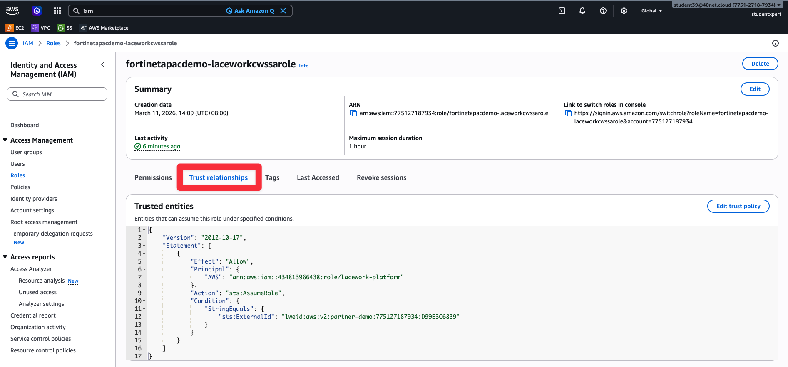
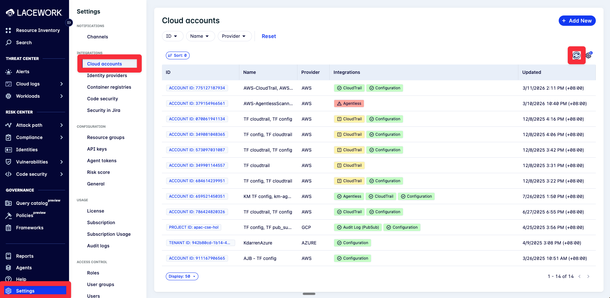

# Lab 2: Integrate AWS Configuration via CloudFormation

## Objectives

FortiCNAPP needs visibility into what resources exist in your AWS account so it can assess compliance, build an inventory, and analyse risk. In this lab, we'll deploy a CloudFormation stack that wires up the Configuration integration. This is the foundation for compliance reporting, resource inventory, and risk analysis in all the labs that follow.

## Lab Steps

### Step 1: Log into AWS Console

1. Navigate to <a href="https://aws.amazon.com/" target="_blank">https://aws.amazon.com/</a>
2. Click **Sign into console**

3. **IMPORTANT:** After logging in, change to your local region (e.g., **Asia Pacific (Singapore)**) using the region selector in the top right of the AWS Console
   - This step is critical - the CloudFormation template will deploy to whatever region is selected
   - If you skip this step, resources will be created in the wrong region

### Step 2: Get CloudFormation Template from FortiCNAPP

1. Log into FortiCNAPP console at <a href="https://partner-demo.lacework.net/" target="_blank">https://partner-demo.lacework.net/</a>
2. Ensure tenant is set to **FORTINETAPACDEMO**
3. Navigate to **Settings** > **Integrations** > **Cloud accounts**
4. Click **Add New**
5. Select **Amazon Web Services** as the cloud provider
6. Choose **CloudFormation** as the integration method

7. In the **Choose integration type** dropdown, select **Configuration**
8. Click **Run CloudFormation Template**
9. This will open the CloudFormation stack creation page in your chosen AWS session (already logged in from Step 1)

### Step 3: Configure and Deploy CloudFormation Stack

The CloudFormation template should now be open in your AWS Console on Step 1 (Create stack). The template URL should already be populated. Configure the stack:

1. Create Stack: Click **Next** to proceed to the next step
2. Specify stack details: Review the parameters and leave them as default

   

   - Stack name will be pre-populated (e.g., `awls-forticnapp-config`)
   - **Resource name prefix** will be pre-populated with the tenant name (e.g., `fortinetapacdemo`) - leave as default
   - Click **Next** to proceed to the next step
3. Configure Stack Options: Leave as default (no changes needed)
   - Scroll to the **Capabilities** section and verify the **I acknowledge that AWS CloudFormation might create IAM resources with custom names** checkbox is checked (it should be pre-checked)
   - Click **Next** to proceed to the next step
4. Review and Create Stack: 
   - Review the stack details and leave as default
   - Click **Submit** to deploy the stack
   - Monitor the stack creation progress. Refresh via the **Refresh** buttons next to 'Stacks' and 'Events'.
   - Review Resources to see the resources created by the stack.
   - Review Outputs to see the outputs of the stack.
   - Review Events to see the events of the stack.
   - Wait for stack status to show **CREATE_COMPLETE**

   - Click **Close** to close the stack creation page

### Step 4: Review CloudFormation Resources

After the stack creation is complete, review the resources that were created:

#### Review CloudFormation Outputs

1. In the CloudFormation stack details page, click on the **Outputs** tab
2. Review the outputs, including the **RoleARN**
   - This is the cross-account access role that FortiCNAPP uses to access your AWS account
   - Note this value for reference

#### Review IAM Role

1. Navigate to **IAM** service in AWS Console
2. Click on **Roles** in the left navigation
3. Find the IAM role that was created (it will be related to the CloudFormation stack name)

4. Click on the role name to view details
5. Review the role's permissions and trust relationships
   - The trust relationship will show that FortiCNAPP (Lacework) can assume this role

### Step 5: Verify Integration in FortiCNAPP

1. Return to FortiCNAPP console - the **CloudFormation Configuration - AWS** dialog should still be open
2. Click **Exit** to close the integration dialog
3. Navigate to **Settings** > **Integrations** > **Cloud accounts**
4. Verify the AWS account appears in the list with Type 'Configuration'
   - You may need to refresh the browser to see the new integration.

## What did we do here?

We connected FortiCNAPP to our AWS account using CloudFormation. The stack deployed a cross-account IAM role so FortiCNAPP can read our AWS configuration.

This is the foundation for everything else. Configuration integration gives FortiCNAPP visibility into what resources exist - which is what powers compliance assessments, resource inventory, and risk analysis in the labs that follow.
