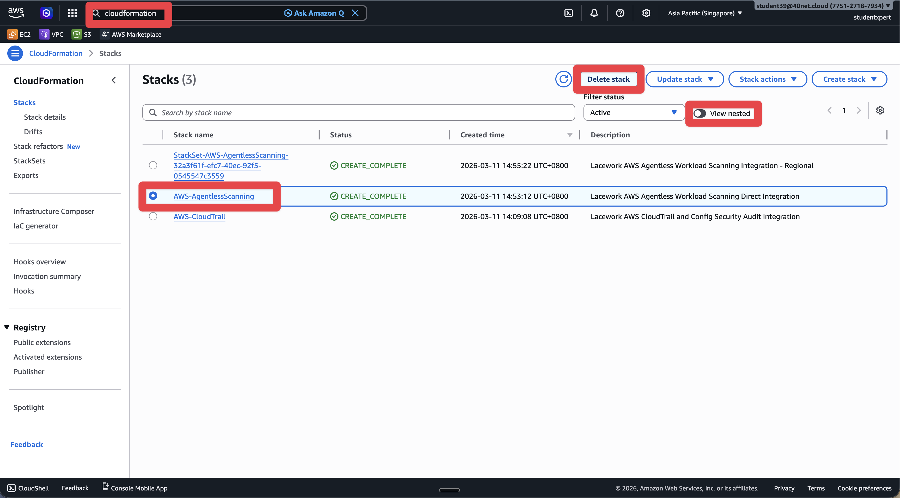
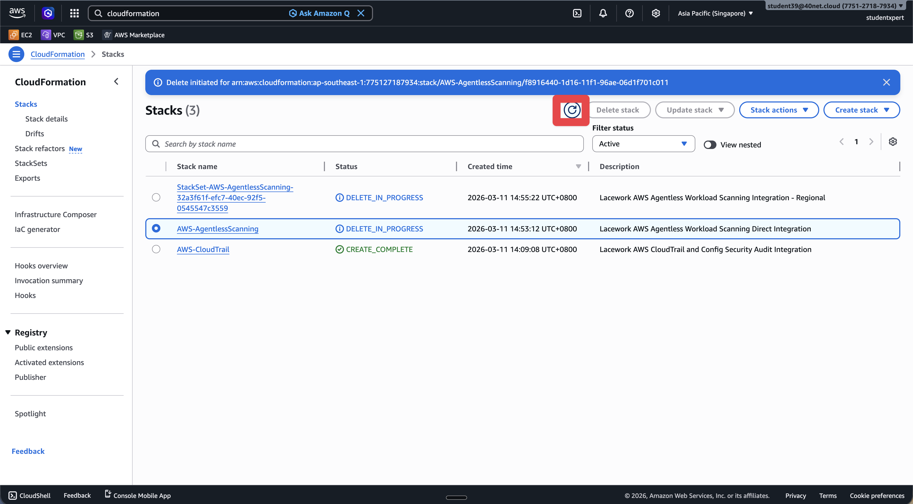
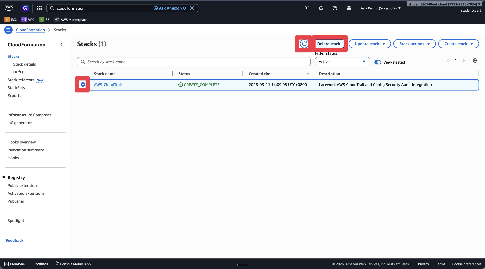
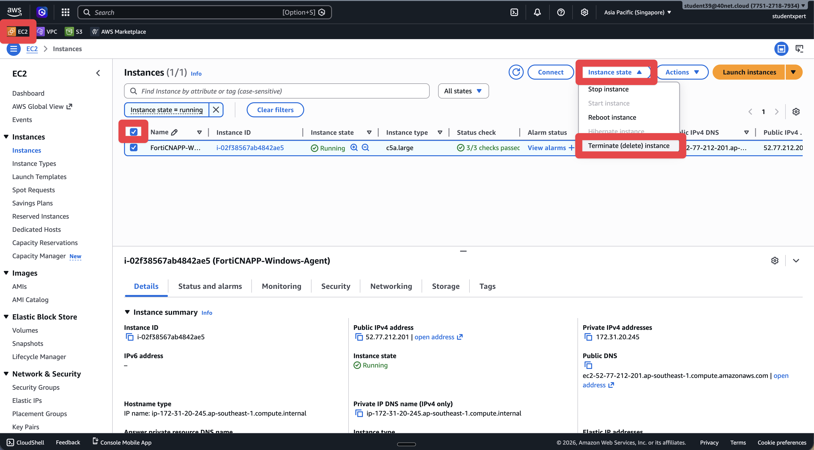

# Lab 7: Clean Up CloudFormation and EC2 Instances

## Objectives

Leaving workshop resources running in AWS costs money. In this lab, we'll delete the CloudFormation stacks from Labs 2 and 3, terminate the EC2 instances from Labs 5 and 6, and verify everything is cleaned up. Always clean up after a lab.

## Prerequisites
- Access to AWS Console

## Lab Steps

### Step 1: Log into AWS Console

1. Navigate to <a href="https://aws.amazon.com/" target="_blank">https://aws.amazon.com/</a>
2. Click **Sign into console**
3. After logging in, change to your local region (e.g., **Asia Pacific (Singapore)**) using the region selector in the top right of the AWS Console

### Step 2: Delete CloudFormation Stacks

#### Delete Agentless Workload Scanning Stack (from Lab 3)

1. Navigate to **CloudFormation** service in AWS Console

2. In the **Stacks** list, find the stack you created in Lab 3 (e.g., `AWS-AgentlessScanning`)
3. Select the stack
4. Click **Delete**
5. Confirm deletion by typing the stack name in the confirmation dialog
6. Click **Delete stack**
7. Wait for the stack deletion to complete (this may take a few minutes)

#### Delete AWS Inventory and CloudTrail Stack (from Lab 2)

1. In the **CloudFormation** service, find the stack you created in Lab 2 (e.g., `AWS-CloudTrail`)

2. Select the stack
3. Click **Delete**
4. Confirm deletion by typing the stack name in the confirmation dialog
5. Click **Delete stack**
6. Wait for the stack deletion to complete (this may take a few minutes)

**Note**: If you see errors during stack deletion, check the stack events for details. Some resources may need to be manually cleaned up if they have dependencies.

### Step 3: Terminate EC2 Instances

#### Terminate Linux EC2 Instance (from Lab 5)

1. Navigate to **EC2** service in AWS Console
2. Click on **Instances** in the left navigation
3. Find the Linux EC2 instance you created in Lab 5 (e.g., `FortiCNAPP-Linux-Agent`)
4. Select the instance
5. Click **Instance state** > **Terminate (delete) instance**

6. Confirm termination by typing `terminate` in the confirmation dialog
7. Click **Terminate**

#### Terminate Windows EC2 Instance (from Lab 6)

1. In the **EC2** service, find the Windows EC2 instance you created in Lab 6 (e.g., `FortiCNAPP-Windows-Agent`)
2. Select the instance
3. Click **Instance state** > **Terminate instance**
4. Confirm termination by typing `terminate` in the confirmation dialog
5. Click **Terminate**

**Note**: Terminated instances will remain visible for a short time before being automatically removed. You may still see them in the list with a "terminated" state.

### Step 4: Verify Cleanup

1. In **CloudFormation**, verify that all stacks have been deleted (the list should be empty or only show other stacks not related to this workshop)
2. In **EC2** > **Instances**, verify that your workshop instances are terminated or no longer visible
3. Optionally, check **S3** buckets and **IAM** roles to ensure any resources created by the CloudFormation stacks have been cleaned up

## What did we do here?

We cleaned up all the AWS resources created during the workshop. Deleting the CloudFormation stacks automatically removes the IAM roles, CloudTrail trails, S3 buckets, and ECS clusters they created. Terminating the EC2 instances stops any running agents and associated costs.

This is important - leaving workshop resources running in AWS will incur ongoing charges. Always clean up after a lab.

