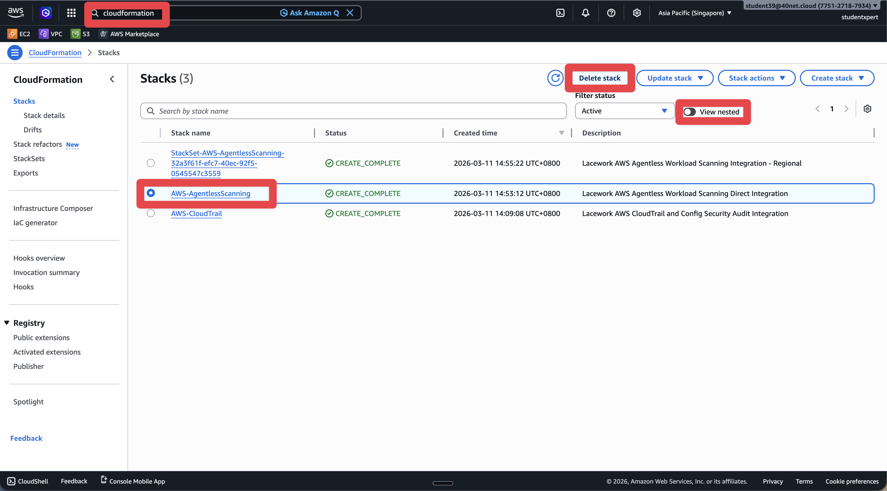
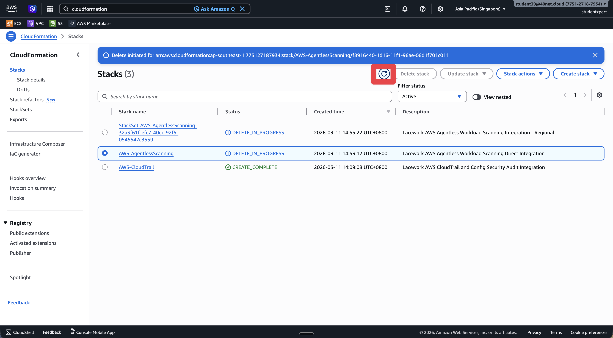
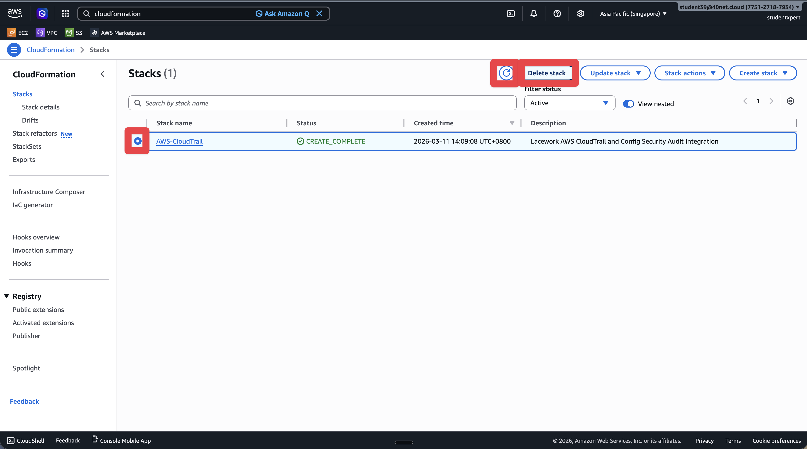
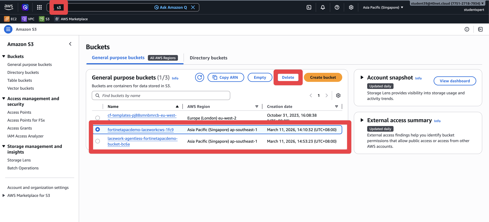
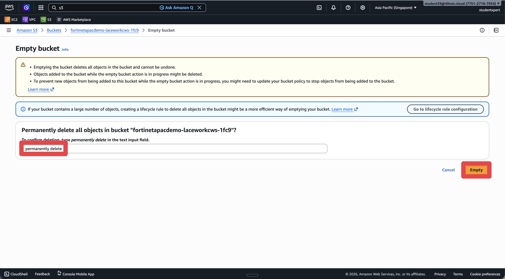

# Lab 7: Clean Up CloudFormation and EC2 Instances

## Objectives

Leaving workshop resources running in AWS costs money. In this lab, we'll delete the CloudFormation stacks from Labs 2 and 3, terminate the EC2 instances from Labs 5 and 6, delete the integrations in FortiCNAPP, and verify everything is cleaned up. Always clean up after a lab.

> **Important**: cleanup has two sides. In Labs 2 and 3 you created the integration record in the FortiCNAPP console **first**, then launched CloudFormation to build the AWS side. CloudFormation never owned that record, so deleting the stack does not remove it. Step 5 below deletes the FortiCNAPP side, and skipping it leaves an integration polling an S3 bucket that no longer exists.

## Prerequisites
- Access to AWS Console

## Lab Steps

### Step 1: Log into AWS Console

1. Navigate to <a href="https://aws.amazon.com/" target="_blank">https://aws.amazon.com/</a>
2. Click **Sign into console**
3. After logging in, change to your local region (e.g., **Asia Pacific (Singapore)**) using the region selector in the top right of the AWS Console

### Step 2: Delete CloudFormation Stacks

#### Delete Agentless Workload Scanning Stack (from Lab 3)

1. Navigate to **CloudFormation** service in AWS Console



2. In the **Stacks** list, find the stack you created in Lab 3 (e.g., `AWS-AgentlessScanning`)
3. Select the stack
4. Click **Delete**
5. Confirm deletion by typing the stack name in the confirmation dialog
6. Click **Delete stack**
7. Wait for the stack deletion to complete (this may take a few minutes)



#### Delete AWS Inventory and CloudTrail Stack (from Lab 2)

1. In the **CloudFormation** service, find the stack you created in Lab 2 (e.g., `AWS-CloudTrail`)



2. Select the stack
3. Click **Delete**
4. Confirm deletion by typing the stack name in the confirmation dialog
5. Click **Delete stack**
6. Wait for the stack deletion to complete (this may take a few minutes)

**Note**: If you see errors during stack deletion, check the stack events for details. Some resources may need to be manually cleaned up if they have dependencies.

### Step 3: Terminate EC2 Instances

#### Terminate Linux EC2 Instance (from Lab 5)

1. Navigate to **EC2** service in AWS Console
2. Click on **Instances** in the left navigation
3. Find the Linux EC2 instance you created in Lab 5 (e.g., `FortiCNAPP-Linux-Agent`)
4. Select the instance
5. Click **Instance state** > **Terminate (delete) instance**


6. Confirm termination by typing `terminate` in the confirmation dialog
7. Click **Terminate**

#### Terminate Windows EC2 Instance (from Lab 6)

1. In the **EC2** service, find the Windows EC2 instance you created in Lab 6 (e.g., `FortiCNAPP-Windows-Agent`)
2. Select the instance
3. Click **Instance state** > **Terminate instance**
4. Confirm termination by typing `terminate` in the confirmation dialog
5. Click **Terminate**

**Note**: Terminated instances will remain visible for a short time before being automatically removed. You may still see them in the list with a "terminated" state.

### Step 4: Delete S3 Buckets

The CloudFormation stack deletion does not automatically remove S3 buckets that contain data. You must delete these manually.

1. Navigate to **S3** service in AWS Console
2. Find the S3 buckets created by the workshop (look for buckets with `lacework` or `fortinetapacdemo` in the name)



3. For each bucket:
   - Select the bucket
   - Click **Empty** to remove all objects (you must empty the bucket before deleting it)



   - Confirm by typing `permanently delete`
   - Click **Delete** to delete the empty bucket
   - Confirm by typing the bucket name

### Step 5: Delete the Integrations in FortiCNAPP

Deleting the CloudFormation stacks removed the AWS resources. The FortiCNAPP integration records are still there, and they have to be deleted separately.

1. Log into FortiCNAPP console at <a href="https://partner-demo.lacework.net/" target="_blank">https://partner-demo.lacework.net/</a>
2. Ensure the tenant is set to **FORTINETAPACDEMO**
3. Navigate to **Settings** > **Integrations** > **Cloud accounts**
4. Find the Agentless Workload Scanning integration you created in Lab 3. It will now show an error, because the S3 bucket it points at was deleted in Step 2:

   ```
   Data loading error: Unable to access scan results within storage bucket
   ```

5. Select the integration and click **Delete**
6. Find the Configuration integration you created in Lab 2 and delete it the same way
7. Confirm the list no longer shows any integration for your AWS account

**Note**: if you also completed Lab 9, `terraform destroy` in Lab 12 removes the Terraform-created integrations for you. Only the CloudFormation-created ones from Labs 2 and 3 need deleting by hand here.

### Step 6: Verify Cleanup

1. In **CloudFormation**, verify that all stacks have been deleted (the list should be empty or only show other stacks not related to this workshop)
2. In **EC2** > **Instances**, verify that your workshop instances are terminated or no longer visible
3. In **S3**, verify that all workshop buckets have been deleted
4. In **FortiCNAPP** > **Settings** > **Integrations** > **Cloud accounts**, verify your AWS account is no longer listed

## What did we do here?

We cleaned up both sides of the integration.

On the AWS side, deleting the CloudFormation stacks removes the CloudTrail trails, ECS clusters, and associated resources. Terminating the EC2 instances stops any running agents and associated costs. Deleting the S3 buckets removes the stored CloudTrail logs, which is a separate step because CloudFormation won't delete buckets that contain data.

On the FortiCNAPP side, we deleted the integration records themselves. This is the step people forget. The console creates those records before CloudFormation ever runs, so nothing in AWS owns them and nothing in AWS can remove them. Leave them behind and they sit in the tenant erroring on every scan cycle, cluttering the integration list for everyone else using it.

This is important - leaving workshop resources running in AWS will incur ongoing charges, and leaving integrations behind pollutes a shared tenant. All clean? Nice work!

