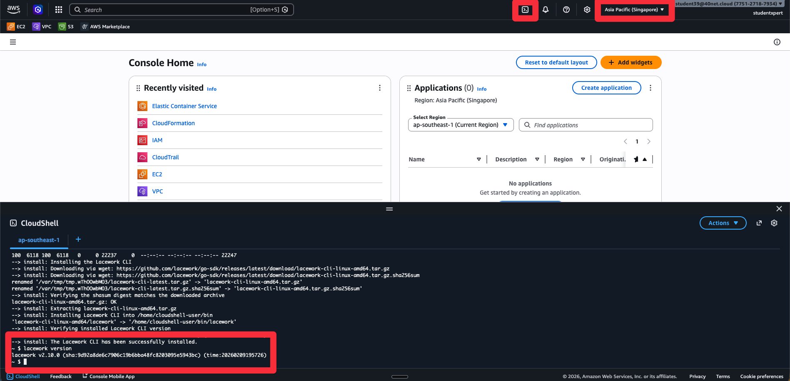
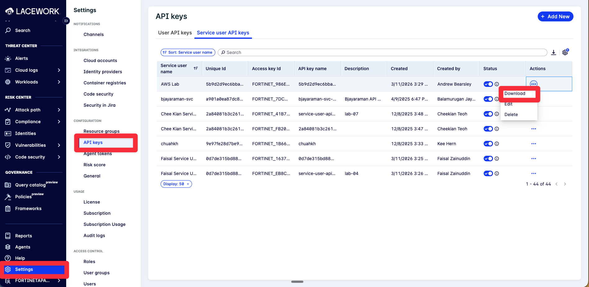

# Lab 8: Install Lacework CLI and Terraform

## Objectives

In Labs 2 and 3, we used CloudFormation to deploy integrations - that's one infrastructure as code approach. But many enterprises prefer Terraform since it's not AWS-specific and works across multiple cloud providers. In this lab, we'll install the two tools needed for the Terraform approach: the Lacework CLI (to generate Terraform configuration) and Terraform (to deploy it). This sets up everything for the next lab.

## Prerequisites

- AWS account access
- FortiCNAPP account credentials

**Note:** If you completed Lab 4, the Lacework CLI is already installed and configured. You can skip Steps 1-6 and proceed directly to Step 7 (Install Terraform).

## Lab Steps

### Step 1: Log into AWS Console and Open CloudShell

1. Navigate to <a href="https://aws.amazon.com/" target="_blank">https://aws.amazon.com/</a>
2. Click **Sign into console**
3. After logging in, change to your local region (e.g., **Asia Pacific (Singapore)**) using the region selector in the top right of the AWS Console
4. Click the **CloudShell** icon in the top navigation bar (cloud icon with `>_` symbol)
5. Wait for CloudShell to initialize (this may take a minute the first time)
6. Once CloudShell opens, you'll have a Linux-based terminal environment ready to use

### Step 2: Set Up Installation Directory

Create a bin directory in your home folder and add it to your PATH:

```bash
mkdir -p "$HOME/bin"
echo 'export PATH=$HOME/bin:$PATH' >> ~/.bashrc
source ~/.bashrc
```

This directory will be used for both Lacework CLI and Terraform installations.

### Step 3: Install Lacework CLI

In the CloudShell terminal, run:

```bash
curl https://raw.githubusercontent.com/lacework/go-sdk/main/cli/install.sh | bash -s -- -d "$HOME/bin"
```

This will download and install the Lacework CLI tool to your home bin directory.



**Note**: For Windows installation (if needed outside CloudShell), download from the <a href="https://github.com/lacework/go-sdk/releases" target="_blank">Lacework CLI releases page</a>.

### Step 4: Download API Key from FortiCNAPP

An existing service user **AWS Lab** has been pre-configured with the necessary permissions. Download the API key for this user:

1. Log into FortiCNAPP console at <a href="https://partner-demo.lacework.net/" target="_blank">https://partner-demo.lacework.net/</a>
2. Ensure tenant is set to **FORTINETAPACDEMO**
3. Navigate to **Settings** > **Configuration** > **API keys**
4. Click on the **Service user API keys** tab
5. Find the API key for the **AWS Lab** service user
6. Click on the ellipsis (three dots) next to the API key and select **Download** to download the key as JSON



7. Open the downloaded JSON file and note the values. Keep these credentials ready for the next step

### Step 5: Configure CLI

In CloudShell, run:

```bash
lacework configure
```

Enter your FortiCNAPP account credentials when prompted. These values are taken from the JSON file downloaded in the previous step:

```json
{
  "keyId": "FORTINET_5DFDAF3B...",
  "secret": "_f1b528...",
  "account": "partner-demo.lacework.net",
  "subAccount": "fortinetapacdemo"
}
```

- **Account**: `partner-demo.lacework.net` (the `account` value from the JSON file)
- **API Key**: The `keyId` value from the JSON file
- **API Secret**: The `secret` value from the JSON file
- **Sub-Account** (if prompted): The `subAccount` value from the JSON file

### Step 6: Verify CLI Installation

```bash
lacework version
lacework api get /api/v2/UserProfile
```

The second command should return your user profile information, confirming the CLI is properly configured and connected.

### Step 7: Install Terraform

Install Terraform in AWS CloudShell:

1. Download Terraform (Linux amd64) and unzip it to your bin folder:

First, get the latest Terraform version:

```bash
TERRAFORM_VERSION=$(curl -s https://api.github.com/repos/hashicorp/terraform/releases/latest | grep '"tag_name":' | sed -E 's/.*"v([^"]+)".*/\1/')
```

Then download and install that version:

```bash
wget -O terraform.zip "https://releases.hashicorp.com/terraform/${TERRAFORM_VERSION}/terraform_${TERRAFORM_VERSION}_linux_amd64.zip"
unzip terraform.zip
mv terraform "$HOME/bin/"
rm terraform.zip
# Configure Terraform to use the temporary directory for cache to prevent running out of cloudshell storage space
echo 'export TF_PLUGIN_CACHE_DIR="/tmp"' >> ~/.bashrc
source ~/.bashrc
```

**Alternative**: If you prefer to check manually, visit <a href="https://releases.hashicorp.com/terraform/" target="_blank">HashiCorp's Terraform releases page</a> and replace `${TERRAFORM_VERSION}` in the URL with the latest version number (e.g., `1.9.5`).


## What did we do here?

We set up the tooling needed for infrastructure as code. The Lacework CLI connects to FortiCNAPP's API, and Terraform lets us define and deploy cloud resources from code instead of clicking through consoles.

In the next lab, we'll use these two tools together - the CLI generates Terraform configuration, and Terraform deploys it. This is the production-ready approach to FortiCNAPP integration: repeatable, version-controlled, and auditable.

